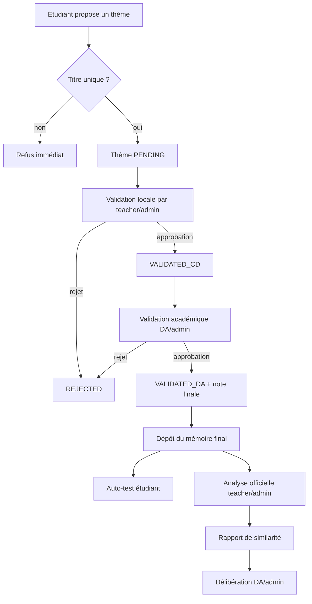

# Origina

Origina est un système intégré de détection de plagiat et de gestion académique conçu pour un contexte universitaire de type IBAM / MIAGE. Le projet couvre le cycle complet d'un mémoire ou d'un travail de recherche: proposition du thème, validation successive, dépôt du document, analyse de similarité, puis délibération finale.

Ce README documente l'existant réel du dépôt pour faciliter une reprise, en particulier si le frontend doit être réécrit en Next.js sans casser le contrat métier déjà porté par l'API Laravel.

## Vision Produit

Le produit vise à centraliser dans une seule plateforme:

- la soumission et la validation des thèmes de mémoire,
- le dépôt final des documents,
- l'exécution d'analyses de similarité multi-niveaux,
- la visualisation des rapports,
- la délibération institutionnelle après analyse.

Le système n'est pas un simple détecteur de texte. Il a été pensé pour couvrir plusieurs formes de plagiat:

- copier-coller direct,
- paraphrase,
- traduction,
- reprise complète de travaux existants,
- suspicion de génération par IA.

## Périmètre Du Dépôt

Le dépôt contient trois blocs principaux:

```text
origina-api      Backend Laravel qui expose l'API métier
origina-client   Frontend React/Vite actuel, à remplacer ou porter vers Next.js
scripts-python   Prototype d'un moteur d'analyse Python
```

## Architecture Globale

### Backend

- Framework: Laravel 13
- Langage: PHP 8.3
- Rôle: exposer les endpoints métier, persister les données, gérer les états de workflow
- Authentification actuelle: très simple, basée sur un identifiant utilisateur transmis par en-tête HTTP

### Frontend actuel

- Framework: React 19 + Vite
- Styling: CSS natif, sans Tailwind
- Persistance locale: `localStorage` pour le thème d'interface et l'utilisateur courant
- Rôle: login démo, tableau de bord par rôle, actions métier, lecture des rapports

### Moteur Python

- Fichier présent: `scripts-python/detector.py`
- Statut: prototype illustratif, pas branché comme moteur réel dans le backend actuel
- Rôle conceptuel: calcul local Shingle, recherche web, estimation de probabilité IA, agrégation JSON

## Rôles Métier

Le code distingue les profils suivants:

- student: étudiant qui propose un thème, dépose son mémoire et lance un auto-test
- teacher: enseignant ou chef de département qui valide localement les thèmes et lance l'analyse officielle
- da: Direction des Études / Direction Académique qui effectue la validation finale et la délibération
- admin: super-rôle technique qui hérite de plusieurs permissions

Le frontend affiche aussi un rôle `var` dans certaines vues, mais le backend ne lui donne pas de traitement spécifique. À considérer comme un artefact d'interface tant qu'un comportement métier dédié n'est pas ajouté.

## Modèle De Données

### users

Champs utiles:

- id
- name
- email
- password
- role
- department
- email_verified_at

Rôle par défaut: student.

### themes

Champs principaux:

- student_id
- title
- description
- status
- moderated_by
- moderation_comment
- moderated_at
- validated_cd_by
- validated_cd_at
- validated_da_by
- validated_da_at
- final_score
- final_score_assigned_at

Contraintes importantes:

- un étudiant ne peut pas proposer deux thèmes avec le même titre,
- les statuts utilisés par le code sont généralement en majuscules: PENDING, VALIDATED_CD, VALIDATED_DA, REJECTED,
- la migration initiale pose un défaut lowercase pending, mais les seeders et la logique métier travaillent en pratique avec les statuts uppercase.

### documents

Champs principaux:

- theme_id
- student_id
- original_name
- storage_path
- mime_type
- file_size
- checksum
- is_final
- submitted_at

Le backend crée actuellement un enregistrement de document avec métadonnées, mais ne reçoit pas le fichier binaire dans le flux métier actuel.

### similarity_reports

Champs principaux:

- document_id
- global_similarity
- ai_score
- risk_level
- matched_sources
- highlighted_segments
- analyzed_at
- generated_by

### deliberations

Champs principaux:

- similarity_report_id
- decided_by
- committee
- decision
- notes
- decided_at

## Workflow Fonctionnel Détaillé

### 1. Connexion

Le login est un login démo simple:

- le frontend appelle /api/login avec email et mot de passe,
- le backend vérifie l'existence de l'utilisateur et le hash du mot de passe,
- l'utilisateur est renvoyé en JSON,
- l'interface stocke l'utilisateur dans localStorage sous la clé origina_user,
- les appels suivants envoient X-User-Id pour identifier l'acteur.

Important: ce n'est pas une authentification session / token complète. C'est un mécanisme fonctionnel de démonstration.

### 2. Proposition De Thème Par L'Étudiant

Flux métier:

1. l'étudiant saisit un titre et une description,
2. l'API vérifie l'unicité globale du titre en base,
3. si le thème existe déjà, la proposition est refusée,
4. sinon, le thème est créé avec le statut PENDING,
5. le thème rejoint la file de validation du corps enseignant.

Règles importantes:

- le titre doit faire au moins 8 caractères,
- le système refuse les doublons insensibles à la casse,
- le refus de thème stoppe le cycle du projet pour ce sujet tant qu'un nouveau thème n'est pas proposé.

### 3. Validation Locale Par Le Chef De Département

Quand le thème est PENDING:

- seul un teacher ou un admin peut valider localement,
- une approbation fait passer le thème à VALIDATED_CD,
- un rejet fait passer le thème à REJECTED,
- un commentaire peut être ajouté,
- l'historique de modération est enregistré avec l'auteur et l'horodatage.

Quand le thème n'est plus PENDING, la validation locale est refusée.

### 4. Validation Académique Par La DA

Quand le thème est VALIDATED_CD:

- seul un da ou un admin peut intervenir,
- une approbation fait passer le thème à VALIDATED_DA,
- une note finale entre 0 et 20 doit être fournie à l'approbation,
- un rejet remet le thème à REJECTED,
- la validation académique écrit les champs de validation finale et la note finale.

Cette étape est le verrou avant dépôt final du mémoire.

### 5. Dépôt Du Mémoire Par L'Étudiant

Le dépôt final est autorisé uniquement si:

- le thème appartient à l'étudiant,
- le thème a été validé par la DA,
- une note finale a déjà été attribuée.

Le backend crée alors un document avec:

- le nom original du fichier,
- un chemin de stockage généré,
- un indicateur is_final,
- une date de soumission.

Le flux actuel est centré sur la métadonnée du fichier. L'upload binaire réel n'est pas encore implémenté dans cette API.

### 6. Auto-Test Par L'Étudiant

L'auto-test est une pré-analyse réservée à l'étudiant propriétaire du document.

Le système génère des scores simulés pour:

- local Shingle,
- recherche web,
- détection IA,
- similarité globale.

Ces valeurs sont enregistrées en mémoire métier sous forme de réponse JSON et peuvent aussi être historisées dans une table de vérification si elle existe dans l'environnement.

### 7. Analyse Officielle Par L'Enseignant

L'analyse officielle est réservée à teacher ou admin.

Conditions:

- le document doit exister,
- le thème associé doit être VALIDATED_DA,
- le document doit être un document final.

Le moteur actuel génère:

- une similarité locale,
- une similarité web,
- un score IA optionnel,
- un score global,
- un niveau de risque low / medium / high,
- une liste simulée de sources,
- des segments surlignés simulés,
- un rapport de similarité persisté en base.

### 8. Consultation Des Rapports

Les enseignants, la DA et l'admin peuvent consulter les rapports.

Le détail d'un rapport renvoie:

- l'objet report,
- une vue d'analyse agrégée,
- une distribution des sources.

### 9. Délibération Finale Par La DA

La délibération finale est réservée à da ou admin.

Décisions autorisées:

- final_validation
- sanction
- rewrite_required

La décision est sauvegardée dans la table deliberations avec les notes de commission, l'auteur et l'horodatage.

## Schéma De Workflow



## Contrat API

### Endpoints généraux

| Méthode | Route       | Rôle attendu | Résultat                          |
| ------- | ----------- | ------------ | --------------------------------- |
| GET     | /api/ping   | public       | santé de l'API                    |
| POST    | /api/login  | public       | vérification email / mot de passe |
| POST    | /api/logout | public       | réponse de déconnexion            |

### Endpoints métier

| Méthode | Route                               | Rôle(s)            | Fonction                             |
| ------- | ----------------------------------- | ------------------ | ------------------------------------ |
| GET     | /api/me/overview                    | connecté           | tableau de bord métier selon le rôle |
| POST    | /api/themes/propose                 | student            | proposer un thème                    |
| GET     | /api/themes/pending                 | teacher, admin, da | lister les thèmes à modérer          |
| PATCH   | /api/themes/{theme}/moderate        | teacher, admin, da | route de modération générique        |
| PATCH   | /api/themes/{theme}/validate-cd     | teacher, admin     | validation locale                    |
| PATCH   | /api/themes/{theme}/validate-da     | da, admin          | validation académique                |
| POST    | /api/documents/upload               | student            | dépôt du mémoire                     |
| POST    | /api/documents/{document}/auto-test | student            | auto-test du document                |
| POST    | /api/documents/{document}/analyze   | teacher, admin     | analyse officielle                   |
| GET     | /api/reports                        | teacher, admin, da | liste des rapports                   |
| GET     | /api/reports/{report}               | teacher, admin, da | détail d'un rapport                  |
| POST    | /api/reports/{report}/deliberate    | da, admin          | enregistrer une délibération         |

### Format D'Authentification Actuel

Le backend résout l'acteur de deux façons:

- en-tête HTTP X-User-Id,
- ou paramètre user_id dans la requête.

Si aucun identifiant n'est fourni, l'API répond en 401.

### Exemples De Payloads

#### Proposition de thème

```json
{
  "title": "Detection de plagiat multilingue par NLP",
  "description": "Evaluation des approches semantiques et traduction inverse."
}
```

#### Modération de thème

```json
{
  "decision": "approved",
  "comment": "Theme valide pour progression.",
  "final_score": 16.5
}
```

#### Délibération

```json
{
  "decision": "rewrite_required",
  "notes": "Demander des références complémentaires pour les passages signalés."
}
```

## Interface Frontend Actuelle

Le frontend React/Vite fournit les écrans suivants:

- page de login avec choix de thème visuel,
- tableau de bord personnalisé selon le rôle,
- liste des thèmes proposés par l'étudiant,
- dépôt de mémoire,
- auto-test de plagiat,
- file de modération des thèmes,
- lancement d'analyse officielle,
- consultation des rapports,
- panneau de délibération,
- visualisation détaillée des graphiques.

### Comportements d'interface importants

- le thème visuel est mémorisé dans origina_theme,
- l'utilisateur connecté est mémorisé dans origina_user,
- le front utilise un mode sombre par défaut,
- l'authentification est purement locale côté UI tant que la page n'est pas rechargée ou déconnectée.

### Comptes De Démonstration

Mots de passe de seed: mon926732

Comptes réellement présents dans les seeders:

- admin@origina.local
- teacher@origina.local
- da@origina.local
- dickoalou04@gmail.com

Le texte de l'UI mentionne aussi d'autres comptes de démonstration, mais ils ne sont pas tous présents dans les seeders actuels. La liste ci-dessus reflète la base initialisée par le code.

## État Réel Du Moteur D'Analyse

Le code actuel ne calcule pas encore une analyse scientifique complète.

Il faut le lire comme une base de démonstration fonctionnelle:

- les scores sont simulés par des nombres aléatoires dans le service Laravel,
- les sources de correspondance sont fabriquées pour illustrer les graphiques,
- les segments surlignés sont des exemples fixes,
- le script Python présent dans scripts-python/detector.py illustre l'architecture attendue, mais n'est pas encore appelé depuis l'API.

Conséquence: les workflows métier existent, mais l'algorithme réel de détection reste à industrialiser.

## Points Importants Pour Une Reprise En Next.js

Si le frontend est repris en Next.js, la partie à conserver comme contrat stable est l'API Laravel existante.

Ce qui doit être repris tel quel:

- les statuts métiers des thèmes,
- le format de réponse des endpoints,
- la logique de rôles,
- les règles de modération,
- la génération et la lecture des rapports,
- le modèle de délibération.

Ce qui mérite d'être refactoré pendant la migration:

- remplacer l'authentification par en-tête par une vraie session ou un vrai jeton,
- gérer le téléversement réel des fichiers,
- remplacer les états locaux du front par une couche de données plus robuste,
- formaliser les types partagés pour les réponses API,
- aligner le rôle var si ce rôle doit réellement exister,
- décider si la détection doit rester simulée ou être branchée sur le moteur Python.

## Installation Et Lancement

### Prérequis

- PHP 8.3+
- Composer
- Node.js et npm
- Base de données compatible avec Laravel
- Optionnel: Python 3 pour la partie prototype d'analyse

### Backend Laravel

```bash
cd origina-api
composer install
cp .env.example .env
php artisan key:generate
php artisan migrate --seed
php artisan serve
```

### Frontend Actuel

```bash
cd origina-client
npm install
npm run dev
```

### Scripts Utiles Côté Backend

```bash
composer run dev
composer run test
```

Le script de développement Laravel démarre le serveur applicatif, la queue, les logs et Vite dans la même session.

## Limites Connues

- l'authentification n'est pas encore sécurisée comme une vraie application de production,
- l'upload de mémoire est modélisé mais pas branché sur une réception de fichier réelle,
- l'analyse de similarité est simulée,
- le moteur Python n'est pas encore intégré au backend,
- certaines mentions d'interface ne correspondent pas encore à la base seedée,
- le rôle var apparaît côté UI mais n'est pas un rôle métier clairement implémenté côté API.

## Résumé Opérationnel

Origina fonctionne aujourd'hui comme une application de démonstration très avancée du cycle académique suivant:

1. l'étudiant propose un thème,
2. le thème passe d'abord par le chef de département,
3. la DA valide ou refuse définitivement,
4. l'étudiant dépose son mémoire final,
5. l'enseignant lance une analyse de similarité,
6. la DA tranche ensuite sur le dossier via délibération.

Pour une reprise Next.js, ce README doit servir de référence fonctionnelle avant d'écrire de nouveaux écrans.
